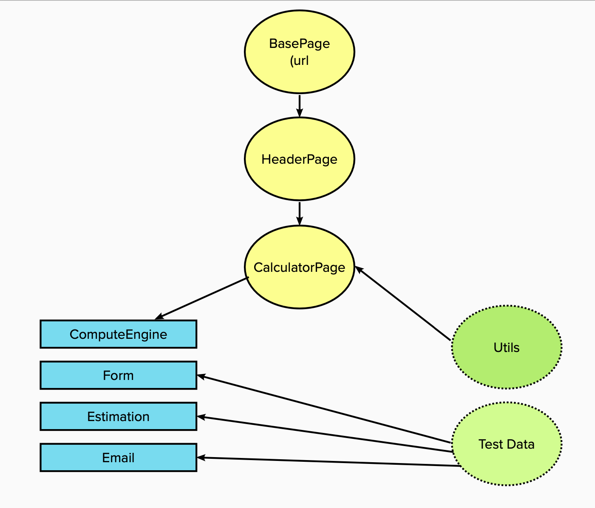

# Google cloud calculator e2e testing

## Framework

- WebdriverIO for configuring the connection to a browser
- Page object design pattern for pages
- Screenshot on fail with corresponding name and date 
- Spec, Junit, and Allure reporters
- Option to run from Jenkins with browser parametrization, selecting test suite
- Test artefacts are archived 

## Structure

## Tools

- Webdriver I/O
- Jenkins
- Allure reporter

## Setup

- clone this repository
- install all dependencies for this project with `npm install` 

## Jenkins Setup for local run

- launch your Jenkins server
- navigate to Manage Jenkins > Manage Plugins 
- install `NodeJS Plugin`
- navigate to Manage Jenkins > Global Toll Configurations > NodeJS installations > Add Node JS
- choose version `NodeJs 18.10.0`
- to the name field add `18.10.0`

## Running job in Jenkins locally

- create a new pipeline
- pipeline script from SCM
- SCM (Git)
- change a path to Jenkins file `Jenkinsfile`
- use the current repo URL(https://github.com/Kryvchenko/google-cloud-e2e)
- build now (will fail, because parameters will be provided after the first build)
- build with parameters (will run)

## Running test locally

- navigate to the project directory 
- open terminal- specify this command BROWSER="chrome or firefox" before the `npm run` command
- to run all tests `BROWSER=chrome npm run test` or `BROWSER=firefox npm run test`
- to run specific tests: `BROWSER=chrome npm run hardcore` or `BROWSER=chrome npm run hurt-me`
- to generate a report: `npm run report` 
- to clean report log : `clean-report` 

